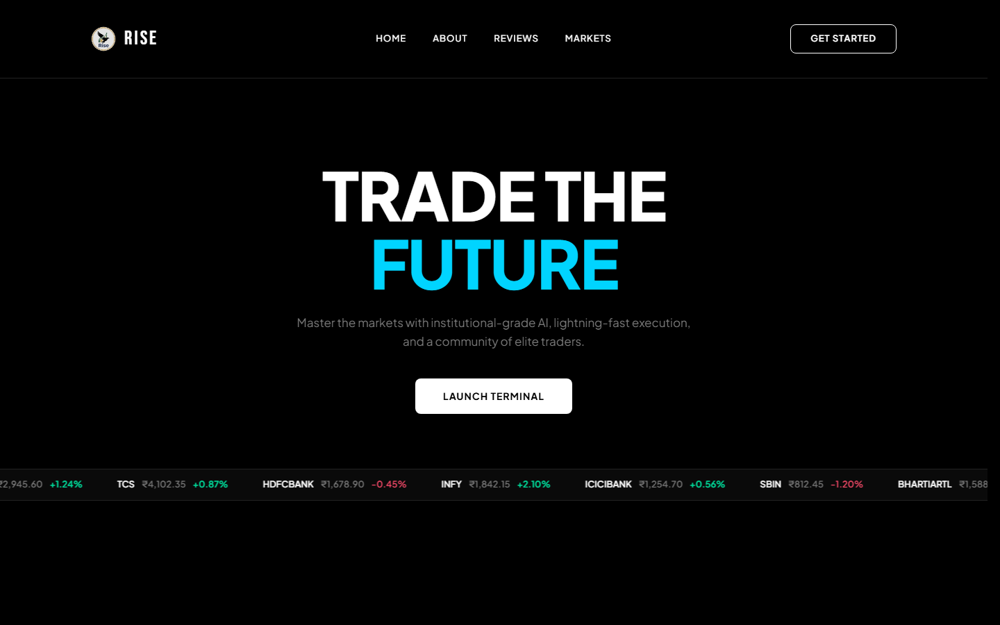
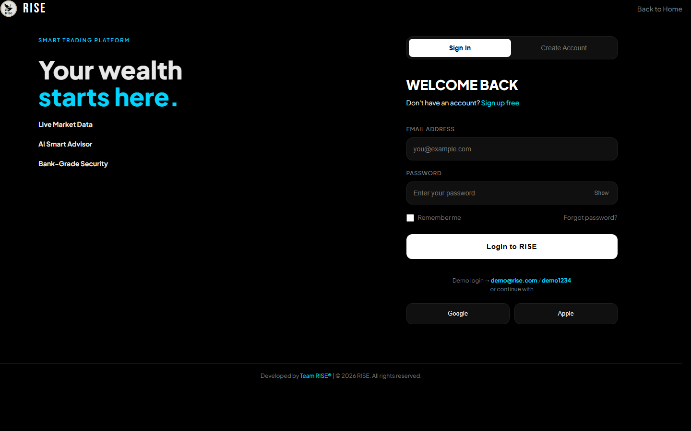

<div align="center">


# RISE

**Institutional-grade market intelligence, built for everyone.**

A trading platform with live market data, AI-assisted guidance,
and a risk-free demo account to learn on.

<br />


</div>

---

## Overview

RISE brings professional market tooling to retail traders — real-time NSE data,
an AI trading coach, and a virtual portfolio so new traders can build intuition
before risking capital.

Built as a single-page React application on Vite, with client-side routing and a
shared design-token system.

---

## Screenshots

<div align="center">

**Home**



<br />

**Login / Register**



</div>

---

## Features

**Live market ticker** — Infinite marquee of NSE large-caps with directional
colour coding, driven by a single data array.

**Scroll-reveal sections** — One `IntersectionObserver` for the whole page,
adding `.visible` as sections enter the viewport.

**Anchor navigation** — Native fragment links (`#about`, `#reviews`, `#graphs`)
with smooth scrolling, deliberately kept outside the router.

**Design tokens** — Every colour, radius, and surface is a CSS custom property in
`global.css`, so the whole palette changes from one block.

**Demo authentication** — Sign in, create an account, or use the demo login.
Session state persists through `localStorage`.

**Embedded charts** — TradingView mini symbol overviews, mounted per symbol.

---

## Tech Stack

| Layer | Choice |
| :--- | :--- |
| Framework | React 19 |
| Build | Vite 8 |
| Routing | React Router 7 |
| Styling | Plain CSS with custom properties |
| Icons | Bootstrap Icons |
| Type | Bebas Neue · Plus Jakarta Sans |
| Charts | TradingView embed widgets |

---

## Getting Started

Requires Node.js 20 or newer.

```bash
git clone https://github.com/eshivansh/RISE.git
cd RISE
npm install
npm run dev
```

Dev server runs at **http://localhost:5173**.

| Command | Description |
| :--- | :--- |
| `npm run dev` | Dev server with hot module replacement |
| `npm run build` | Production build into `dist/` |
| `npm run preview` | Serve the production build locally |
| `npm run lint` | Run ESLint across the project |

---

## Project Structure

```txt
rise/
├── public/
│   └── assets/              Images, video, logo, screenshots
│
├── src/
│   ├── main.jsx             Entry — router provider + global styles
│   ├── app.jsx              Route table
│   │
│   ├── pages/
│   │   ├── Home.jsx         Landing page
│   │   ├── Login.jsx        Login / register
│   │   └── Welcome.jsx      Post-login app shell
│   │
│   ├── components/
│   │   └── TradingViewWidget.jsx
│   │
│   └── styles/
│       ├── global.css       Tokens, reset, shared primitives
│       ├── homepage.css
│       ├── login.css
│       └── welcomepage.css
│
├── index.html               Shell — fonts, icons, root node
└── vite.config.js
```

Each page imports its own stylesheet; Vite bundles them into one file at build
time. The split is for maintainability, not delivery.

### Routes

| Path | Component | Notes |
| :--- | :--- | :--- |
| `/` | `Home` | Public landing page |
| `/login` | `Login` | Sign in / create account |
| `/welcome` | `Welcome` | Post-login shell |

---

## Status

| Area | Markup | Styles | Notes |
| :--- | :----: | :----: | :--- |
| Design tokens & reset | — | ✅ | `global.css` — palette, type, layout primitives |
| Home page | ✅ | ✅ | Hero, ticker, features, about, testimonials, markets, footer |
| Login / Register | ✅ | ✅ | Split-panel layout with working auth flow |
| Welcome — app shell | ✅ | ✅ | Fixed sidebar, user badge, nav, sign out |
| Welcome — content | ⬜ | ⬜ | Hero, account stats, movers, tips |
| Dashboard | ⬜ | ⬜ | Planned |
| Portfolio & watchlist | ⬜ | ⬜ | Planned |

---

## Roadmap

- [ ] Welcome dashboard — virtual portfolio and watchlist
- [ ] AI Trading Coach powered by the Gemini API
- [ ] Live market quotes via Alpha Vantage
- [ ] Debounced symbol search with dropdown results
- [ ] Candlestick chart integration
- [ ] Trade analytics and performance history
- [ ] Backend authentication and persistent storage

---

## Deployment

The build deploys to GitHub Pages as a static SPA. Three settings matter:

1. **`base`** in `vite.config.js` must match the repository name — `"/RISE/"`.
2. **`basename`** on `BrowserRouter` must be `import.meta.env.BASE_URL`, or no
   route matches once served from a subpath.
3. **`404.html`** must be a copy of `index.html`, so client-side routes survive a
   direct visit or a refresh.

Verify a production build locally before pushing:

```bash
npm run build && npm run preview
```

---

## Contributing

Work happens on personal branches, merged into `main` by pull request.

```bash
git checkout -b your_branch
git commit -m "Describe the change"
git push -u origin your_branch
```

**Conventions**

- One stylesheet per page — shared primitives stay in `global.css`
- Reference colours through custom properties, never raw hex
- Run `npm run lint` before opening a pull request
- Sync with `main` regularly: `git fetch origin && git merge origin/main`

---

## License

Released under the MIT License.

<div align="center">
<br />

**Developed by Team RISE**

</div>
